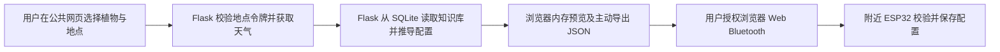

# 134 前后端分化：当前部署结构

> 原件：`../134-前后端分化.md`。本副本按现行 Flask 网站与浏览器 BLE 实现修订。依据见 [[130-阅读说明]]。

## 职责表

| 层 | 当前职责 | 不应当被误认为 |
| --- | --- | --- |
| 浏览器公共前端 | 场景表单、地点联动、结果展示、导入导出、用户授权 BLE、当前页面状态 | 云端永久保存用户配置；独立的硬件安全控制器 |
| Flask 后端 | 植物和系数读取、地点令牌签发与校验、外部天气查询、参数推导、配置校验、管理 API | 直接操作附近 ESP32 的蓝牙或 GPIO；云端项目/设备同步数据库 |
| SQLite | 植物与计算系数、系统维护日志 | 用户账号、设备账号、场景和配置历史库 |
| 浏览器 BLE 层 | 连接附近设备、SWS-BLE 1.0 分包、请求响应、读写配置与设备操作 | Render 服务器转发的远程控制链路 |
| ESP32 固件 | 接收/保存配置、报告状态和历史、执行设备侧校验与硬件操作 | 已经由网页上线证明完成水泵和传感器实物联调 |
| Cloudflare / Render | DNS 与 Docker Web Service 对外提供 HTTPS 网站 | 自动提供持久数据库或已完成管理端 Access 策略 |

## 当前配置流向

配置生成时后端不创建用户项目或代码版本记录。设备读回与模式切换通过浏览器 BLE 完成，浏览器关闭后不会自动继续连接。设备不在附近或浏览器不支持 Web Bluetooth 时，仍可查看网站及部分配置功能，但不能据此操作实体设备。

## 管理流向

`admin.smrtwatering.com` 到达同一 Flask 服务，返回独立管理页面。前端在当前页面内存持有用户输入的管理员密钥，管理 API 依 Host 与 Bearer 密钥校验。2026-09-17 只验证登录表单出现。当前 `preview` 禁止植物库保存和 Git 快照；Cloudflare Access 尚未创建。

## 与旧方案的差异

原笔记所写“Flask 保存场景、生成 Arduino 固件代码、维护设备同步状态，ESP32 经 SoftAP 或云 API 拉取配置”对应历史设计，不是本次上线站点的现行主流程。如果要恢复这些能力，需要另行定义持久化表、认证、设备网络连接与同步状态。硬件侧原有 SoftAP 页面可独立存在，但不能与本网站的 BLE 流程混为一谈。
